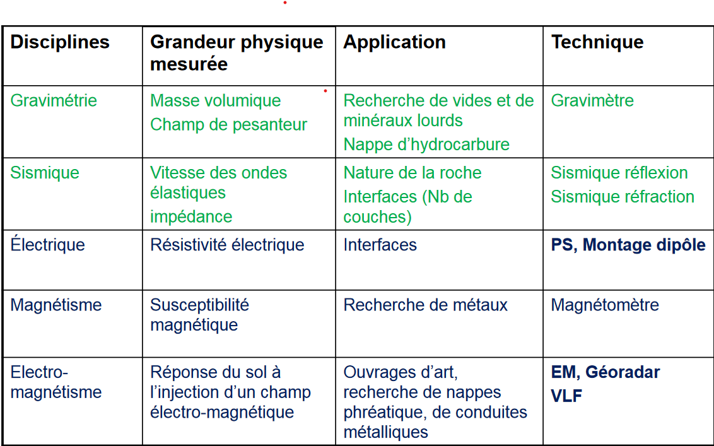
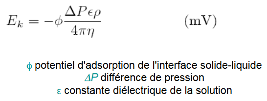
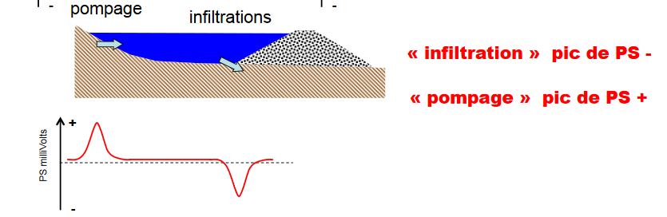
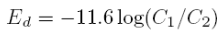
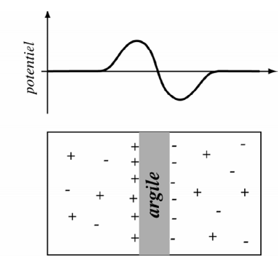
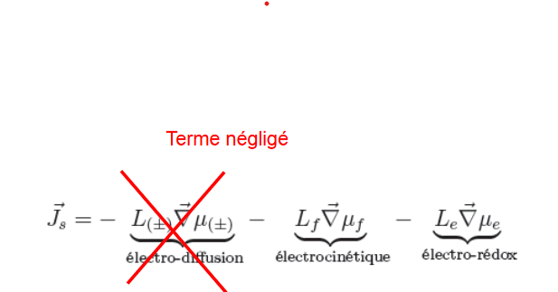
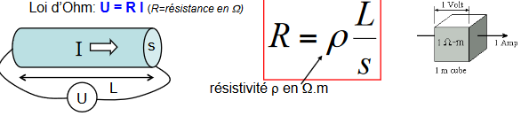
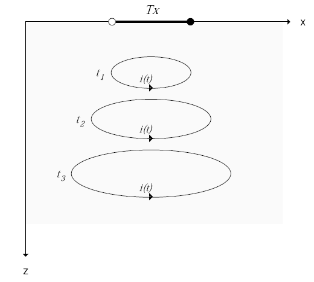
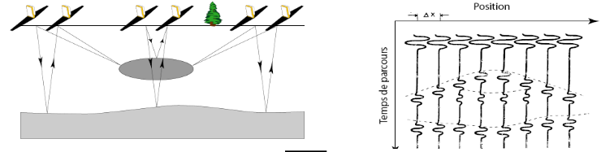

# Méthodes de prospection géophysique

- Application d'un ensemble de méthodes physiques : gravimétrie, électricité, magnétisme, sismique afin d'approcher les propriétés et / ou la structure du massif
- Mesure d'une grandeur physique et de leur variation
- Méthode indirectes et non-destructives de reconnaissance et d'auscultation
- Mesure volumique : technique aisée et peu coûteuse -> Etape préliminaire de nombreuses études (dégrossissage structural, repérage d'anomalie)

Pour une polarisation spontanée électrique, il n'y a pas de variation de fréquence cumulée. Son unité est le mV.

Haute fréquence : période très petite (f: 1/T)

investigation géophysique -> acquisition de données 1,2 ou 3D :

- **profil** (1D) : déplacement au sol et profondeur fixée
- **log** (1D) : courbe en fonction de la profondeur
- **carte** (2D) : déplacement au sol selon x ou y (surface du sol)
- **coupe** (2D) : déplacement au sol selon une direction et une profondeur
- **bloc diagramme** (3D)

## I) Polarisation spontanée électrique 

### Introduction

Le géophysicien s'intéresse aux **propriétés électriques** des sols (inclus sol végétal) et des roches : **caractérisation et imagerie du sous-sol**. Spontané : polarisation naturelle

Propriété électrique : 

- activité électrochimique (base de la **PS**)
- **résistivité** : difficulté avec laquelle on peut faire passer un courant électrique dans la roche, contraire de la conduction, non naturel. L'unité est Ωm.
- constante diélectrique : capacité des roches à emmagasiner de l'énergié et à la rstituer, à la base de la **polarisation provoquée**

Accès à des profondeurs d'investigation élevées : structure invisible à d'autres méthodes

Point commun de ces méthodes : ***mesure potentiel électrique***

Différence entre les méthodes électriques et électromagnétisme : façon de générer les courants électriques. En électromagnétisme c'est le champ électrique fonction d'une fréquence va générer un champ électrique

Associée à des mécanismes de polarisation de charges électriques dans le milieu poreux. 

- phénomène physique qui correspond à la génération de potentiels électriques dans les sols sans influence humaine
- terme utilisé pour désigner la méthode de prospection basée sur la mesure du phénomène

La PS est causée par l'activité électrochimique ou mécanique : altération des sulfures, variation de la composition des roches aux contacts géologiques, activité bioélectrique du matériel organique, corrosion, gradients thermiques et pression dans les fluides souterrains.

Principe de mesure passive. Les données de potentiel spontanée sont mesurés en surface, on va ensuite pouvoir créer des modèles de circulation en profondeur. On mesure la **différence** de potentiel d'origine naturelle entre deux points du sol. Les courants électriques induits liés à des phénomènes **électrocinétiques** et **électrochimiques**.

En PS, on a uniquement une mesure de voltmètre (mV à 1 ou 2 V)

Deux phénomènes : 

- **phénomènes électrocinétiques** : mouvement de fluide, infiltration de l'eau de pluie écoulement des nappes, ***Ek***
- **phénomènes électrochimique** : 2 formation en surface contact, 

    - "solutions" à concentration différente (argiles et sables aquifères par exemple) -> phénomènes "**osmotiques**" 
    - **présence d'une masse conductrice** (amas de minéral métalliques ou schistes graphiteux) partiellement enfouie sous  le niveau hydrostatique

### A) Sources naturelles du potentiel électrique

#### 1. Potentiel électrocinétique 

Observé lorsqu'une solution de **résistivité ρ** et de **viscosité η** traverse un matériau poreux, d'origine mécanique il se produit généralement sous influence de la gravité.

Ek généralement d'effet négligeable, sauf pour les topographies marquées sur la conduction hydraulique de l'eau d'imbibition, ou que la végétation agit suffisamment sur le drainage de l'eau souterraine. Plus le terrain sera pentu, plus la circulation des électrons sera grande -> anomalie électrocinétique en fonction de la topographie.

Mouvement de fluide : pompages et infiltrations

Migration de fluides :

- anomalies + -> flux de fluide en subsurface, zones de décharges, pompages
- anomalies - -> zones d'infiltrations

Facteurs lithologiques et structuraux :

- anomalies + -> zones très argileuses
- anomalies - -> zones d'accumulation de débris grossiers
- changement brusque de magnitude ou de signe -> contact géologique probable
- anomales - dans une roche homogène -> fractures

#### 2. Potentiel de diffusion

De nature chimique, f(T°C) il est dû à la différence de mobilité des ions dans une solution de concentration variable.  L'équilibre ne peut se faire également de part et d'autre et un ΔV est généré. 

Quand on a deux formations en électrochimie, on a deux types de formations différentes, Ec va être fonction de la température et des concentrations de fluide. Si les concentrations sont bien marqués, on aura une valeur élevée.

#### 3. Potentiel de Nernst

Lorsque deux électrodes métalliques sont immergées dans une solution dont la concentration est différente pour les deux électrodes, il y a un ΔV de crée. Il s'agit d'un phénomène chimique (les porteurs de charges sont des ions)

Ed et Es définissent le **potentiel de membrane**

#### 4. Potentiel de contact électrolytique

Lorsque 2 électrodes de métaux différents sont introduites dans une solution électrolytique.  

Combinaison des potentiels de diffusion, Nernst et contact ≡ **potentiels de minéralisation** => anomalies souvent bien distinctes du bruit de fond et associées à des métaux.  ⇒ **détection de gisements métallifères par mesure de ΔV à la surface**.

#### 4. Autres sources  

- variations de T°C: un effet mineur (sauf volcanisme) 
- corrosion métallique (tuyaux, câbles, carcasses métalliques) : ΔV locaux 
- courants telluriques (induction de l'ionosphère, explosion nucléaire, tempêtes électriques) pas stables dans le temps 
- effet bioélectrique observé à la frontière entre clairière et forêt : eau souterraine drainée par les racines des arbres => ΔV pouvant être confondus avec ceux produits par les sulfures (de l'ordre de quelque centaines de mV)

### B) Le potentiel de minéralisation

Les porteurs de charge sont des électrons Associé avec les sulfures métalliques, le graphite et certains oxydes métalliques telle que la magnétite.

L'anomalie au dessus des sulfures métalliques (pyrite, chalcopyrite, pyrrhotite, sphalérite, galène, graphite) de quelques mV à 1 V, 200 mV étant considérée comme une bonne anomalie.  Les potentiels observés sont généralement négatifs, relativement stables dans le temps.  Possibilité de distinguer le potentiel de minéralisation des bruits de fond dus à toutes les autres causes (tendance à s’annuler). On peut s'en servir comme méthode d'exploration car ΔV sont stables dans le temps et les valeurs sont 1V au dessus de la minéralisation.

L : Propriétés de transports des ions, de l’eau porale et des électrons 
∇μ : gradients de potentiels chimiques respectifs 

### C) La PS comme méthode de prospection

Attention au choix des électrodes : performance dépend de leur polarisation et de leur dérive.  

**Polarisation** = potentiel mesuré entre une paire d'électrode en l'absence d'une source externe = effet dû uniquement à l'équipement qui peut perturber la mesure.  

**Dérive** = variation dans le temps de la polarisation (éviter électrodes métalliques et privilégier les «pots-poreux », plus chers, mais beaucoup moins polarisables).  

Sources de bruit possible : Induction magnétotellurique, potentiel thermo-électrique, potentiel bioélectrique, potentiel de diffusion (ou potentiel de membrane), les sources anthropiques

### D) Les différentes méthodes d'acquisition

Technique du gradient : la paire d'électrodes se déplace simultanément, d'un point de mesure à l'autre : mesures le long d'une ligne => profil. Plusieurs profils => surface statique.  

Méthode rapide mais il faut additionner toutes les valeurs pour obtenir ΔV, les erreurs de zéro s'additionnent et il faut veiller à garder toujours la même polarité des électrodes. 

Technique Base-Fixe : on ne déplace qu'une électrode tout en gardant l'autre fixe. L'électrode mobile est déplacée de façon à couvrir la surface d'investigation. 

- Avantages : lecture directe car les mesures sont faites avec une même référence, et les erreurs de zéro entre les deux électrodes ne s'accumulent pas. 
- Désavantage principal : manipulation des fils fastidieuse.

### E) Interprétation des résultats 

Obtention de contours ou de profils.  

- anomalie située directement au dessus du corps la générant, ou déplacée par un effet topographique.  
- interprétation surtout qualitative ; idée du pendage avec le gradient des courbes de contours.  
- forme du corps anomal indiquée par la forme des contours 

### F) Applications de la polarisation spontanée

#### 1. Application à l'hydrologie

Le champ électrique, présent naturellement dans le sous-sol, est influencé par la géométrie de la source ainsi que par la distribution de la résistivité électrique du milieu => mesure ayant une origine dynamique liée à l’écoulement de l’eau 

Intérêt en hydrologie des mesures de PS : 

1. l’identification de la direction et de l’intensité des mouvements de fluides dans le sous sol 
2. la délimitation de systèmes hydrothermaux 
3. le suivi de panache de contamination 
 
Développements d’électrodes stables dans le temps, et outils de filtrages. Avantages : méthode non invasive, faible coût et facile à mettre en place, large surface d’investigation en peu de temps (=> 1000 mesures/j) 

PS = électro-diffusion + phénomène d'oxydo-réduction + **électro-filtration**

Electro-filtration : Excès de charges transporté par un écoulement du fluide dans le milieu poreux crée une source de courant d’origine électrocinétique  => Circulations hydriques à l’origine des signaux de PS associés aux essais de pompage / infiltration 

#### 2. Application à des panaches de contaminations

Le phénomène électro-rédox dans les panaches de contamination peut-être assimilé au phénomène d'oxydo-réduction rencontrés dans les gisements de minerai. Mais mécanisme de transfert de charges reste encore mal compris : rôle majeur probable des **bactéries**?

Les mécanismes de dégradation de la Matière Organique : dégradation aérobie, hydrolyse, acidogenèse, méthanogenèse, maturation

#### 3. Applications en volcanologie

Acide sulfurique H2S, dioxyde de soufre SO2 et CO2 : composants principaux des gaz volcaniques Les réactions chimiques entre ces gaz et les roches peuvent contrôler l’environnement chimique des volcans et des champs géothermiques avoisinants. Génération des ions sulfates ?? 

1. Oxydation par l’oxygène dissout dans l’eau de percolation :  H2S + 2O2↔H2SO4Mais 2O2 très faible, n’explique pas les formations des ions sulfates dans les sources chaudes 
2. Oxydation par l’oxygène de l’air : Vitesse trop lente 
3. Oxydation par des composés ferriques dans les roches : H2O + SO2↔H2SO3. Ce dernier réagit avec des ions ferriques, pour former l’ion sulfate

### Sondage électrique

Analyse de la résistivité apparente du sous sol mesurée par un dispositif quadripôle symétrique (ABMN) pour une succession d'écartement des électrodes AB

-> propagation d'un courant électrique dans le sol

Loi d'Ohm : U = RI

Pour 100m, on peut avoir une profondeur d'investigation entre 25m (conducteur) et 10m (résistant) en fonction de la résistivité du sol

### Trainée électrique

analyse de la résistivité apparente du sous-sol par un quadripôle symétrique ABMN de dimension constante, traîné le long d'un profil -> dimension du dispositif (fixe) induit une profondeur d'investigation à peu près constante

## II) Prospection électromagnétique

### Mesure

En régime variable : champ électrique et champ magnétique étroitement liés -> **Électromagnétisme**
Un champ magnétique variable engendre un champ électrique -> induction électromagnétique de Faraday. 

Analyse de la résistivité apparente du sous sol (ρa ) mesurée par un dispositif quadripôle symétrique (ABMN) pour une succession d'écartements des électrodes AB ->propagation d'un courant électrique dans le sol. Mesure du potentiel électrique **généré par l'injection d'un courant continu** (DC) dans le sol. On va jouer sur la profondeur d'investigation. On cherche les corps électriquement conducteurs dans un environnement résistant.
On doit utiliser un courant alternatif dans une bobine qui va générer le champ magnétique primaire. Nous allons regarder la variation des deux champ magnétiques.

Résistivités des roches: propriété physique qui détermine la capacité de ce milieu à laisser passer le courant électrique.

Le s sera directement lié à la profondeur d'investigation.

Les valeurs restent apparentes et ne reflètent qu'une valeur moyenne dans un espace délimité.

La conduction est l'influence de la teneur en sels (augmente la conductivité), idem pour la température. La composition des fluides joue un rôle majeur dans la résistivité. L'unité est de millisiemens / m -> électromagnétisme

On peut le faire dans tous les milieux car il n'y a pas d'interaction avec le sol. Ce que nous allons regarder ce sont des rapports de champs. Hs/He. Ce sont des dipôle qui sont dans le même plan. Le rapport entre les deux champs magnétiques peuvent remonter à la conductivité.

- en verticale : le champ magnétique sera plus profond
- en horizontal : sondage de la surface

Plus le milieu est conducteur, plus faible sera la profondeur d'investigation. Si la conduction n'est pas trop grande, on peut déterminer la conduction avec le rapport de champ. La conductivité est apparente. Elle est fonction de ce que va mesurer l'outil.

On cherche à déterminer d'où provient le champ secondaire. Pour 3m, on sonde 1,50m de profondeur en sondage verticale. En horizontal la valeur est maximale en surface. En verticale, on va sonder deux fois plus.

Si la conductivité ne varie pas de façon significative à mois d'une distance, on peut considérer que le sol est latéralement uniforme.

### Méthodes : 

- permafrost
- détection de gravier
- cartographie d'invasion saline
- détection de karst
- détection et cartographie de zones pollués ou contaminées
- cartographie de ma topographie des sols
- cartographie de la conductivité du sol mis à la terre
- détection des tuyaux et conducteurs métalliques 

### Outils

- EM31, il a un espace de s = 3,7m, il va sonder jusqu'à 6 en verticale et 3m en horizontal. 

- EM34, on peut espacer l'émetteur et le récepteur s =10,20 et 40 m. Il va sonder jusqu'à 60m. Deux grands cerceaux en cuivre au sol. On va aussi mesurer une conductivité apparente. Suivant la distance à laquelle on va positionner nos cerceaux, cela nous permettra d'aller plus profond. Pour aller loin, la fréquence doit être petite avec un temps de période long. Un même matériau ne donnera jamais la même valeur. 

### Avantages

- excellente résolution de la conductivité
      - l'extension latérale du volume de sol échantillonné est approximativement la même que l'extension verticale
      - de faibles perturbations de conductivité et est facilement et précisément mesurés
- pas de problème d'injection de courant
  - couplage électromagnétique
  - pas de problème de résistance de contact aux électrodes
- simplicité d'interprétation 
- mesures faciles et rapides

### Désavantage

- attention au milieu conducteur
- attention au changement de temps
- "le zéro" il faut un zéro de référence, mettre à un endroit très résistant permettant de normalisé

### Autres outils

- système à onde plane (TBF) : très basse fréquence. L'onde va pouvoir pénétrer loin. On a une antenne positionné dans un point donné. Le récepteur sera plus loin. Formations très profondes. On peut aller sur plusieurs dizaines de profondeurs. On peut chercher des cavités. Les fréquences vont pouvoir cartographier la profondeur du site.

- TDEM : résolution dans le temps. Etude qui sont faites à de très grandes profondeurs. On travaille en fréquence dans le temps. La fréquence ne bouge pas. On va analyser un seul point comme un sondage. On regarde l'évolution de notre champ magnétique une fois qu'on arrête de le générer. Permet de visualiser une coupe. On maintient le courant dans une boucle un certain temps. Le champ magnétique statique va s'établir. On va couper le courant mais la force électromotrice va se déplacer dans le sol. L'intensité du courant va être fonction de la résistivité du sol. On va récupérer le champ magnétique dans le temps. Le champ magnétique va se déplacer et sera différent. Plus le temps passe, plus le champ magnétique va diminuer. 

Avantages : rapidité d'opération, taille du dispositif de l'ordre de la taille de la profondeur d'exploration. L'information sera concentré à la verticale.

- résolution latérale (en utilisant des stations adjacentes)
- résolutions des couches conductrices et réduction du domaine d'équivalence 

Inconvénients : Ne fonctionne pas bien quand c'est trop conducteur et ne fonctionne pas bien en milieu résistant. Peu de moyens d'interprétation, sensible au bruits, il faut placer le récepteur à quelque distance de la boucle.

## III) Géoradar

Un géo-radar est constitué d'un émetteur et d'un récepteur. Également de plusieurs antennes. Il peut se déplacer à plusieurs dizaines de km/h. On va regarder un contraste de constance diélectrique (résistivité) entre la "cible" et l'encaissement. Ce qu'on regarde c'est une reflexion d'onde radar. Un profil en deux dimensions en fonction de z.

### Principe général

On envoie une impulsion EM en haute fréquence. L'impulsion induit une onde électromagnétique qui se propage dans le sol. Quand elle va rencontrer un milieu différent, cela va se réfléchir et se rétracter est enregistrée par une antenne réceptrice. La mesure de cette onde va permettre de construire une image du sous-sol. 

Tous les profils avec un temps de ns sont du géo radar. En ms c'est de la sismique. On peut aller jusqu'à plusieurs centaines de mètre.

Equation de Maxwell : 

Le courant de déplacement doit être plus important que le courant du milieu. On peut changer la fréquence de l'antenne. Pour que l'onde EM s'enfonce dans le sol, il faut qu'elle soir importante. Si l'onde ne se propage pas, nous n'aurons pas de signal. Selon l'importance des pertes du signal, les  champs se déplacent 

- en mode diffusif : diffus (pertes non négligeables)
- en mode propagatif : faibles pertes

géo radar = mode propagatif

Pour l'examen : regarder l'unité de mesure

