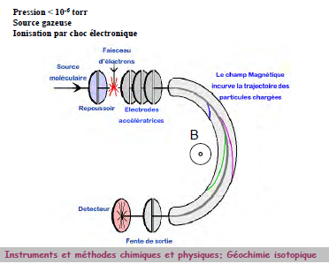
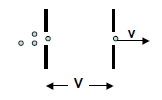
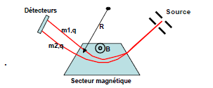
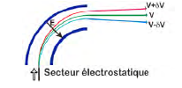

# Outils d'observation et d'analyse en Géosciences 

## I) Spectrométrie de Masse : principes et instruments

### A) Introduction

En 1834, Michael Faraday définit les ions comme les espèces chimiques responsables de la conductivité électrique. En 1898 Wien a montré qu'un flux d'ions peut-être dévié par un champ électrique et magnétique. En 1912 Thomson montre l'existence de deux isotopes du néon en utilisant un simple appareil à déflexion magnétique. En 1918 Dempster et en 1919 Aston fabriquent des appareils plus élaborés qui permettent de mesurer l'abondance relative de différents isotopes. Les premières spectromètres de masse réellement utilisables ont
été mis au point pour l'industrie du pétrole dans les années 50. Ils permettaient d'analyser des molécules organiques de masse environ 500 et avec un point de "fusion" en dessous de 350-C.

A partir de ces isotopes, nous pouvons dater des roches et ainsi déterminer l'âge du système solaire à l'aide de météorites.

Fractionnement isotopique des éléments légers : <

- géothermométrie et géobarométrie
- identification des processus de surface et des processus biogénique
- environnement, paléoclimat, paléo environnement

### B) Principe général d'un spectromètre de masse

#### Les différents filtres de masse existantes

1. **Secteur magnétique** : séparation des ions par un champ
2. **Temps de vol** : séparation des ions en fonction de leur temps de vol
3. **Quadripolaires** : séparation des ions par un champ électrique modulé
4. **Transformée de Fourier (FT-ICR)**: mesure des rapports isotopiques par spectrométrie infra-rouge. Les fréquences de rotation ou de vibration d'une molécule dépendent de la masse des atomes qui la composent. Résolution très bonne aux faibles masses.

#### Accélération des ions

Les ions placés dans un champ électrostatique subissent l'action d'une force constante qui leur communique un mouvement uniformément accéléré. L'énergie cinétique acquise en fin d'accélération est égale à zV.

zV = 1/2 mv² 

A la sortie du champ électrostatique, tous les ions ayant la même énergie cinétique, leur vitesse dépendant de leur masse.
Un champ élevé (x kV) permet une meilleure résolution (énergie cinétique des ions << zV) et donc la mesure de masses plus élevées.

#### Spectromètre magnétique

Un ion accéléré à une vitesse v sous l'action d'un champ magnétique B perpendiculaire à sa trajectoire est soumis à une force perpendiculaire à v et à B, suivant la règle d'AMPERE et de valeur Bzv. Cette force est la force centripète d'un mouvement circulaire uniforme de rayon R,
que l'on sait être égale à mv² / R :

F = Bzv = mv²/R d'où R = mv/Bz

Pour B donné,

mv/z = (2Vm/z)^1/2 d'où R = (2Vm/B²z)^1/2

et

m/z = B²R² /2V

z étant la charge de l'ion.

#### Mesure des énergies cinétiques

Un ion placé dans un champ électrostatique circulaire E perpendiculaire à sa trajectoire est soumis à une force zE perpendiculaire à sa trajectoire. C'est la force centripète d'un mouvement circulaire de rayon r tel que **zE = mv² /r**

R ne dépend que du rapport V/E.

L'énergie cinétique totale des ions comprend

- l'énergie d'accélération (zV0);
- l 'énergie d'émission
-les perte d'énergie (choc ou fragmentation)

#### Appareil à double focalisation

**Focalisation en direction**

Les ions issus d'une fente ont des trajectoires divergentes. Entre cette dernière
et la fente du collecteur s'exerce l'action focalisante des champs magnétique et
électrostatique.

**Focalisation en énergie**

La double déflection des ions par un champ électrostatique et un champ magnétique
permet de corriger cette dispersion en énergie et d'obtenir une "haute résolution".

#### Avantages / désavantages

Ils peuvent atteindre des résolutions de masse très élevées. Ils sont très stables et peuvent accumuler des mesures sur de longues périodes -> grandes précisions des mesures

Cependant, le temps des mesure est long. La gamme de masse réduite en multcollection. Les instruments sont souvent massif et coûteux.

### C) Spectromètres à temps de vol

Les Spectromètres à temps de vol sont les instruments les plus simples.
Des ions de masses différentes quittant la source simultanément
avec la même énergie mettent un temps différent
pour atteindre le détecteur.

-> sources à courte durée de temps (sources pulsées)
-> collecteur à haute résolution dans le temps.

Des ions de masses m1 et m2 auront des vitesses: vi = 2V^1/2/ mi^1/2.

Si la distance du trajet est d, le temps mis ti est :

ti =d mi^1/2 / 2V^1/2,

t1/t2 = v2/v1 = (m1/m2)^1/2

Le pouvoir de résolution est donné par :
m/dm = 1/2t/dt 

v= 1,39. 104 (zV/m)1/2

Si V = 5000 V et m = 2500 D,

v = 2 . 104 m sec-1 (20 km/sec ou 7200 km/h)

Pour un trajet entre la source et le collecteur est de 2 m, t = 10-4 sec.
Si le plus petit intervalle de temps qui peut-être mesuré par le collecteur est de 5nsec, le pouvoir de résolution est de ~10 000.

#### Avantages / désavantages

Très grande sensibilité : tous les ions émis sont détecter. Analyse de surface. Technologie simple, peu encombrantes. Différents systèmes d'ionisation possible (faisceau d'ion, laser, haute tension)

Temps de mesures longs, à cause des délais entre chaque acquisition. La précision est limitée.

### D) Spectrométrie de masse Quadripolaire

Le premier spectromètre de masse a été développé par Paul et al dans les années 60 et maintenant c'est le type de spectromètre le plus utilisé.

Un quadripôle est constitué de quatre électrodes parallèles de section hyperbolique ou cylindrique. Les électrodes opposées distantes de 2 r0 sont reliées entre elles et soumises au même potentiel.

Les électrodes adjacentes sont portées à des potentiels de même valeur, mais opposés de sorte que l'écart de potentiel soit égal à Φ0. Ce potentiel Φ0 résulte
de la combinaison de tensions, l'une continue (U) l'autre alternative (V) de haute
fréquence f : 

Φ0 = U-V . Cos(2pi f t)

Un point de coordonnées (x,y,z) situé dans le champ électrique sera soumis au potentiel : 

Φ = Φ0 (x²-y²)/r0²

La tension continue appliquée seule va extraire les ions du quadrupôle, en les attirant vers l'extérieur si leur trajectoire n'est pas exactement centrée. La tension alternative va leur donner un mouvement circulaire et des trajectoires en hélice.

La trajectoire d'un ion pénétrant dans le quadripôle sera décrite par les équations de Mathieu selon les deux autres axes.
Il est possible de définir des valeurs U et V des zones de stabilité telles que les coordonnées x et y de l'ion restent
strictement inférieures à r0. Les ions qui se trouvent dans cette zone auront donc une trajectoire stable dans le
quadripole et seront détectés. Avec U/V constant, un balayage de U permet l'observation successive des ions de masse croissante. La résolution entre ces ions est d'autant plus grande que la pente de la droite est élevée.

#### Avantages / désavantages

Il ne nécessite par d'aimant et il est très compact. Il n'est pas nécessaire d'avoir un potentiel très élevé pour la source. Le temps de balayage de la plage de masse peut - être très rapide. On a pas besoin des fentes et il possède un haut niveau de transmission des ions. 

Comparé à un spectromètre magnétique sa plage de masse et son pouvoir de résolution sont beaucoup trop modestes.

### D) Spectromètre Infra rouge à transformé de Fourier (FT-ICR)

Séparations des ions par mesure de la fréquence de vibration d'un ion qui est inversement proportionnelle à la masse.

Principe: : mesure de l’absorbance α à partir du spectre d’absorption

#### Avantages / désavantages

Mesure de la concentration totale satisfaisante. Instrument adaptable à la mesure précise moyennement : changement de la source laser et adaptation du trajet optique

La fréquence élevée d'acquisition des mesures de concentration -> interêt pour les espèces à variation photochimique rapide comme NO, NO2 ou O3.

### E) Les différentes techniques d'ionisation

**Impact Electronique EI** : Les électrons, émis par un filament chauffé, et accélérés par un potentiel (70 eV) interagisent avec les molécules sous forme gazeuse de l'échantillon.

**Ionisation chimique CI** : Ionisation par impact électronique sur un gaz réactif (CH4 ou NH3) en large excès par rapport à l'échantillon (A). L'ionisation du réactif est suivi par une réaction ion/molécule.

**Fast Atom Bombardment** : Les molécules fragiles comme les peptides sont dissous dans une goutte de glycérol. Cette solution est déposée sur une cible qui est bombardée par des atomes accélérés d'un gaz comme l'argon ou le xénon. Ue onde de choc se propage et expulse la molécule chargée avec un proton.

**TIMS** : L'échantillon (après séparation chimique) est déposé sur un filament (Ta, W, Re, Pt). Lors du chauffage, l'évaporation et l'ionisation sont soit simultanées (filament simple) soit consécutives (filament double ou triple). Chaque échantillon est déposé sur un filament qui va être placé dans un barillet pouvant contenir treize filaments. Le filament est chauffé entre 800 et 1000K, ce qui permet à l'échantillon de s'ioniser. Le faisceau obtenu est optimisé en ajustant le barillet, en réglant la vitesse du faisceau ou en réglant la focalisation verticale et horizontale.

**MC-ICP MS** : Échantillon liquide : ionisé dans un plasma d'Ar à 6000K. Cônes : interface source / analyseur : ne laissent passer qu'une partie des particules selon leur masse. On injecte des aérosol dans la torche, tout sera transformé en ion avec la température très importante. L'analyseur va sélectionner les ions selon leur énergie cinétique. L'électro - aimant sépare les ions selon leur masse.

**SIMS** : Determination des variations isotopiques et géochimiques à très courte échelle. Imagerie isotopique et géochimique. Pas de chimie mais les rapports isotopiques obtenus sont normalement moins précis que ceux déterminés après séparation chimique par les autres méthodes. Des ions primaires sont crées à partir d'un gaz (en général O, Ar, ..) dans une source à impact électronique ou par thermo-ionisation (Cs). Ils sont ensuite accélérés et localisés dans la colonne primaire sur une zone de l'échantillon (0,2 à 10µm selon l'élément et de la sonde). Combinaison de deux secteurs électrostatiques et magnétique en couplant les deux secteurs dans l'espace de manière à obtenir la double focalisation.

**Détecteurs** : 

- Cage de Faraday : Quand le faisceau d'ions frappe le fond de la cage Faraday, un courant électrique est produit. Ce courant est mesuré à travers une très grande résistance (typiquement 10^11 Ω). La forme allongée de la cage, ainsi que les plaques de suppression d'électrons, minimise la perte d'éventuels électrons secondaires, qui altéreraient le signal. Mesuré ainsi, un signal de 10^-11 A générera un signal de 1Volt. 

- Multiplicateur d'électrons : Quand un ion atteint la première
dynode, plusieurs électrons sont émis. Le potentiel électrique qui est imposé entre les dynodes successives, accélèrent les électrons émis vers la dynode suivante. Chaque électron qui frappe une dynode provoque l'émission de plusieurs autres électrons, qui sont à leur tour accélérés ….

- Galette à micro canaux : utilisée pour l'imagerie ionique, composée de milliers de petits multiplicateurs à dynodes continus. Le gain engendré par une plaque dans les SIMS permet d'atteindre facilement un gain de 10^6.

#### Analyses

Standard : échantillon dont la composition isotopique est connue et reconnue internationalement.

Chaque session d'analyse débute par le passage de standards.

Les analyses au spectromètre de masse introduisent un fractionnement isotopique instrumental. Tous les isotopes d'un même élément n'ont pas le même rendement d'ionisation. Il est lié soit au processus d'ionisation, soit à la transmission du spectromètre, soit au fonctionnement du collecteur. Chaque technique analytique a donc un fractionnement qui lui est propre.

Dans le cas de l'analyse d'éléments avec au moins deux isotopes non radiogéniques, une normalisation interne peut être réalisée en utilisant une valeur reconnue au niveau international.

146Nd/144Nd = 0,7219, 86Sr/88Sr = 0,1194

Grâce à ces rapports connus, une correction du fractionnement dépendant de la masse induit par l'analyse peut être effectuée. Cette correction suit une loi linéaire, puissance ou exponentielle.

Dans le cas d’isotopes stables, ou lorsque l’élément
analysé ne possède pas deux isotopes non
radiogéniques : 

– la correction se fait par comparaison avec un
standard analysé dans les mêmes conditions que
l’échantillon
– ajouter un autre élément, d'une masse semblable
à celle de l'élément étudié, avec deux isotopes
non-radiogéniques qui peuvent être utilisés pour
une correction interne.

## II) Techniques de préparation des échantillons et séparation chimique, protocoles analytiques

## III) Acquisition et traitement des données

