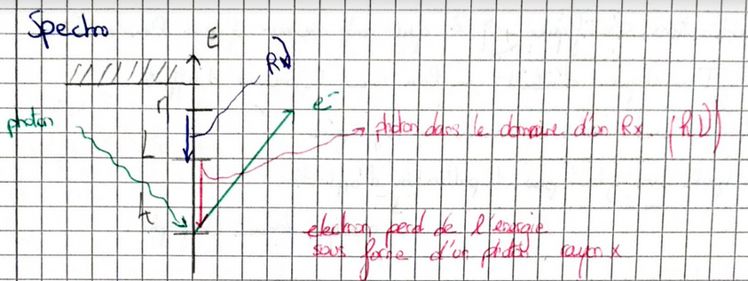
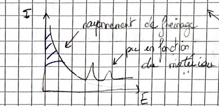
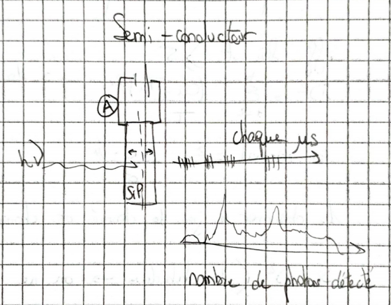
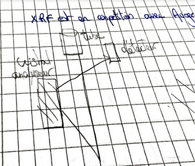
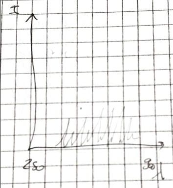
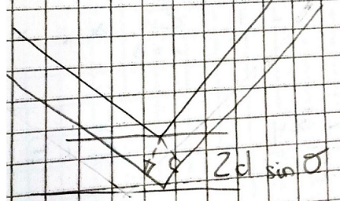
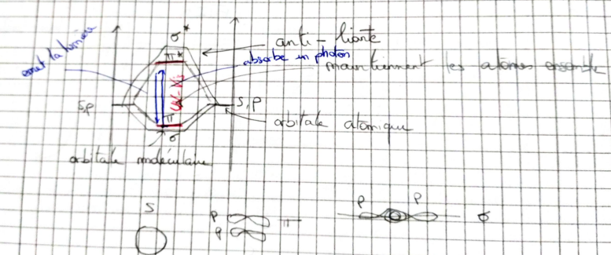
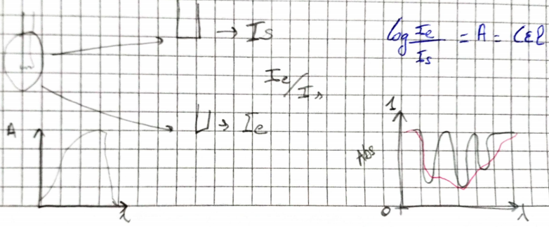
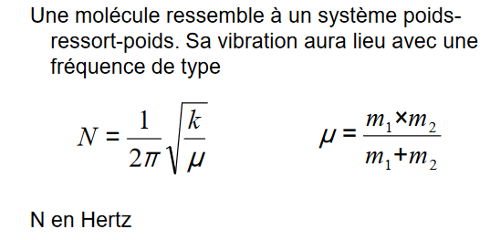
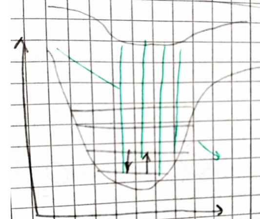

# Techniques

Préparation d'échantillons : lithopréparation, séparations, extractions...

Observations et analyses : techniques chimiques, physiques, spectrométrie (masse), spectroscopies (photons, électrons, protons, ions...)

Compréhension des résultats : statistiques, traitements d'images..

# Objectifs

- Savoir sur quelle technique se tourner pour résoudre un problème en géosciences
- Savoir reconnaître une technique à partir d'éléments limités (spectre, unités...)
- Comprendre les processus physiques sous-tendant les techniques d'analyse 
- Connaître les limites actuelles des différentes techniques
- Connaître les principales contraintes sur la préparation des échantillons

https://sourceforge.net/project/pymca 

Observation de la force électromagnétique. Toutes les particules se comportent avec une equation de rotation. Les caractéristiques spins sont les porteurs du magnétisme.

Liaison covalente : mise en commun de deux électrons

Agitation dans l'infrarouge

Atome = noyau + électrons occupant des orbitales atomiques qui ne sont pas des orbitales circulaires

Spin -> changement de rotation de l'axe d'une particule

En transférant de l'énergie à un électron, on peut aussi lui faire changer d'orbitale atomique

Règle de Klechkowski permettant de reconstruire l’ordre des énergies croissantes des énergies croissantes des sous-couches électroniques.

Molécule : assemblage d'atomes liés par des liaisons chimiques

Liaisons chimique : mise en commun d'électrons dans des orbitales moléculaires

Orbitale moléculaire :  combinaison linéaire d'orbitales atomiques

Comme pour les orbitales atomiques, seules les orbitales de plus basse énergie sont remplies. Les orbitales de plus haute énergie sont vides à l’état fondamental. Comme pour les orbitales atomiques, en transférant de l’énergie à un électron, on peut le faire changer d’orbitale moléculaire. Pour simplifier et par analogie avec les atomes: les noyaux sont formés de plusieurs nucléons qui peuvent occuper dans le noyaux des niveaux discrets d’énergie. Il existe donc un état d’énergie. Il existe donc un état fondamental (énergie minimale) et des états excités. En transférant de l’énergie à un noyau, on peut le faire passer dans un état excité. Les techniques spectroscopiques vont toutes faire interférer des ondes électromagnétiques avec les orbitales atomiques ou moléculaires ou encore atomiques ou moléculaires ou encore avec les spins électroniques ou nucléaires.

IRM : rayonnement du noyau d'hydrogène

Raman : niveau de vibration des molécules

IR : niveau de vibration de même molécules

Diffusion : électron qui change de phase, d'énergie ou de trajectoire

## Ondes électromagnétiques

représentent la propagation d’un champ électrique et d’un champ magnétique alternatifs et perpendiculaires. Sont portées par un photon.

3 caractéristiques chimiques : 

- techniques élémentaires : caractéristiques sur les éléments
- techniques moléculaire : caractéristiques sur la molécule
- spéciation : environnement chimique local

Pour chaque techniques :

- le principe physique (domaine spectral et le mode d'interaction entre les photons et la matière)
- appareillage (exciter et détecter)
- spectre 
- infos diverses
- a quoi ça sert

## Fluorescence X, XRF

XRF (X-Ray Fluorescence) : émission de rayon X lié à la relaxation d'un atome. Il est excité car il a une lacune en couche profonde. La **relaxation** est faite par le **transfert** d'un électron d'une **couche externe vers une couche profonde**. L'ionisation en couche profonde est dûe par l'absorption d'un photon X incident.

Rayons X sont ceux de haute énergie. L'unité d'énergie est en keV en abscisse. En ordonnée on a une émission en Intensité du signal (AU ou cp ou cp/s).

Pour générer des rayons x : Sources

1. on utilise un élément radioactif (100 euros)
2. tube à rayons x : on fait interagir des électrons avec une cible en métal (100K d'euros)

3. rayonnement synchrotron : appareil dans lequel on fait tourner des photons à la vitesses de la lumière (1 milliard d'euros)
 
Détection :

- Dispersion en énergie : utiliser les photons de la lumière et les trier en fonction de l'énergie du photon sur un semi-conducteur. Pas toujours de photons car XRF est en compétition avec des électrons Auger. On voit tous les élements.

- dispersion en longueur d'onde : le détecteur va permettre de compter les photons. Les photons arrivent au cristal analyseur et repartent vers le détecteur. Les rayons arrivent en parallèles 2d sinθ. Les chemins ont la même longueur entre la source, le cristal et le détecteur. Pas de spectre. On sélectionne les élements. Equation de Bragues.

Infos diverses : Les éléments doivent avoir une couche L. Seulement à partir du Bore qu'on peut l'observer. Plus on avance dans le tableau, les résultats sont meilleurs pas de H, He, Li, Be et les plus légers. 

Utilité : La fluorescence permet une analyse élémentaire qualitative et/ou quantitative. Il existe des ensembles source/détecteur portables (pistolet) manipulables sur le terrain. Méthode peu sensible aux conditions de T, P,... et aux liaisons chimiquesMéthode non destructive. Peut permettre de regarder les peintures au plomb.

## Libs

Transfert électronique entre le continuum et une couche interne. Technique élémentaire : composition élémentaire de l'échantillon. Emission optique induite par laser. On fait une émission optique. Un électron est éjecté, un électron sera mis à sa place en émettant un photon proche UV-IR.

**Domaine spectral** : proche UV- IR

Spectre avec des longueur d'onde de **250 à 900 nm**. Beaucoup plus de pics et plus fins. L'excitation sera du au **laser**. La détection est une **caméra optique CCD**.

En Libs, on voit tous les éléments. Efficace sur les éléments légers. Différence entre XRF et Libs, le calcul des quantités. Libs se base sur la physique des plasmas. Plus compliqué pour doser.

## DRF

Diffraction des rayons X

## UV - Visible

On peut mesurer deux choses en UV-Visible : 

- absorption
- émission
  

La spectroscopie UV-visible (UV-vis) mesure l'absorption d'un rayonnement ultra-violet ou visible par une molécule. Cette absorption correspond à l’excitation des électrons impliqués dans les orbitales moléculaires vers des états excitésLes rayonnements UV-vis peuvent aussi être utilisés pour stimuler et mesurer la fluorescence émise par les molécules cibles

Le verre et le quartz absorbent toutes les ondes en dessous de 200nm. Il faut opérer avec un miroir sous vide. On se limite à la gamme de liaison pi et pi*. Les orbitales sont sigma sont plus énergétiques et donc en dessous de 200nm.

Un orbitale moléculaire est deux atomes qui ne vont pas être fixes l'un par rapport à l'autre mais vibre tant qu'on est pas au 0 absolu.

Toutes les orbitales ont une orbitale de basse énergie et des orbitales vacantes qui ont un plus grande énergie. Nous allons regarder depuis la haute occupé à la basse vacante.

a dernière orbitale moléculaire remplie est nommée HO (haute occupée)La première orbitale moléculaire vide est nommée BV (basse vacante)Ce sont les orbitales frontières

Lorsque l'on regarder une transition d'une orbitale excité vers un orbitale mois excité, ça provoque de la luminescence. 
La fluorescence se compte à une dizaine de nano-seconde. La longueur d'onde est plus grande à la descente qu'à la montée.

Limites: faible concentration, pas de réaction entre solvant et soluté, pas de dissociation, pas d’autre soluté ou solvant absorbant, lumière monochromatique. Marche très bien si le minéral est dilué.

Les transitions détectées sont généralement π→n ou n→π* caractéristiques de nombreux de composés organiques.Les transitions σ→σ* et n→σ* sont trop énergétiques pour être facilement observées ( opération sous vide). Il faut aussi connaître les choses qu'on étudie. Ce n'est adapté pour savoir ce qu'il y a dans une solution.

Certaines longueurs de vibrations sont autorisés et d'autres sont interdit. Plus on monte en énergie, plus le va et vient de l'atome sera plus grand. On envoie un photon qui va permettre de montée un électron sur une orbitale moléculaire supérieure et sa distance de va et vient sera plus grande. L'émission est en IR. 

## IR

En IR on regarde l'absorption. Le photon doit avoir la bonne énergie pour faire monter l'électron. On a plus de place d'avoir des signaux séparés dans l'IR que dans l'UV. La spectroscopie IR mesure l'absorption d'un rayonnement infrarouge par une molécule. Cette absorption correspond à l’excitation des mouvements de vibration et de rotation des molécules.Deux chemins optiques suivis par deux faisceaux d’ondes IR. L’un traverse l’échantillon, l’autre non. Le rapport d’intensité entre les deux faisceaux caractérise l’absorption des IR par l’échantillon. Le miroir change la longueur du chemin des ondes selon qu’elles passent par le miroir fixe ou mobile. L’onde incidente est cohérente donc il se produit des interférences positives ou négatives.La source est polychromatique, toutes les longueurs d’ondes IR (proche et moyen) sont présentes en même temps.

Interféromètre : système de mesure où on envoie la lumière polychromatique sur un miroir semi-transparent. L’interférogramme est la représentation de l’intensité reçue par le détecteur en fonction de la position du miroirLa Transformation de Fourier permet de décomposer l’interférogramme en une somme de fonctions sinusoïdales, représentant chacune une onde donnée. Nécessite moins d’optiques, notamment d’optiques dispersives, donc maximise l’intensité transmise par le système: plus de photons sur l’échantillonLe mouvement du miroir est très rapide (s), on peut accumuler les spectre (les sommer avant transformation de Fourier)La position du miroir est repérée par laser dans le domaine visible: précis et répétable.

N =  nombre de vibrations par seconde. Donc utilisation du nombre d'onde.

Les valeurs en Hertz sont trop grandes, on les exprime en nombre d’onde (cm-1) (division par c, célérité de la lumière dans le vide). 

V_ = N/C (cm/s)

Le spectre représente les liaisons entre deux types d'atome. On peut donc connaître la nature d'un élément mais pas la quantité. On voit les liaisons mais pas toutes. On voit les liaisons qui provoquent un moment dipolaire sur les deux atomes. Si les atomes ne sont pas identiques, (diatomique), il n'y a pas de moment dipolaire. Si il n'y a pas de moment dipolaire ni de variations, on ne voir rien avec l'infra-rouge.

Il faut observer ça avec trois atomes (H2O, CO2). Sur l'eau, on a une charge moins sur l'oxygène et une charge plus sur l'hydrogène. On peut faire trois rotations, trois translations et trois déformations (symétrique, anti-symétrique et changement d'angle qui va entraîner un changement dipolaire). Des vibrations seront invisibles et d'autres seront visibles. Une vibration se verra d'autant plus, la vibration sera grande. Des vibrations auront le même niveau d'énergie **niveaux dégénérés**. Chacun des atomes de molécules ont des degrés de liberté. Il arrive qu'il y ai des rotations qu'on ne voit pas bien. Pour les molécules linaires, on ne voit pas les rotations. Un atome a trois coordonnées dans l’espace, donc trois degrés de libertéUne molécule n’est pas un assemblage rigide, donc son degré de liberté total est la somme des degrés de liberté de ses n atomes constituants: 3n.

* 3n - 6 quantité de vibration dans une molécule
* 3n - 5

Certaines vibrations peuvent être situé au même endroit. Grande gamme spectrale avec des pics bien définis.

Problème : l'eau absorbe très bien l'IR. Et des molécules sont inactives.

## Raman

En Raman, on va regarder les mêmes niveaux de vibrations des mêmes liaisons moléculaires. En Raman, on fait une **diffusion inélastique** des photons. Le photon a juste donné ou prit une énergie et continu sa route. La diffusion est 10Gx moins probable que l'IR. Il faut un laser. La diffusion Raman est une diffusion (le photon n’est pas annihilé) inélastique (avec perte ou gain d’énergie) pendant laquelle la molécule cible change de niveau de vibration ou de rotation.La longueur d’onde du faisceau incident ne doit pas correspondre à un saut d’énergie quantifié.

Soit il fait monter un niveau d'excitation soit il le fait descendre. Il est beaucoup plus intense vers le haut que vers le bas où il gagnera de l'énergie. Le principe de la diffusion Raman se base sur la variation de polarisabilité de la molécule sous l’effet du champ électrique de la radiation incidente.Pour avoir un effet Raman, la vibration de la molécule doit produire une variation de polarisabilité dont la dérivée est non nulle.

Le spectre Raman montre les mêmes vibrations que l'IR. Les ordonnées sont en I (intensité). La polarisabilité de la liaison est une dérivée non nulle à la position de repos de la vibration. Même pour des liaisons diatomiques. Elle ne doit pas être la même entre de une vibration et une autre. (antisymétrique ne marche pas pour une molécule linéaire). Il peut potentiellement avoir de la fluorescence. On voit dans le Raman la même gamme spectrale que l'IR.

