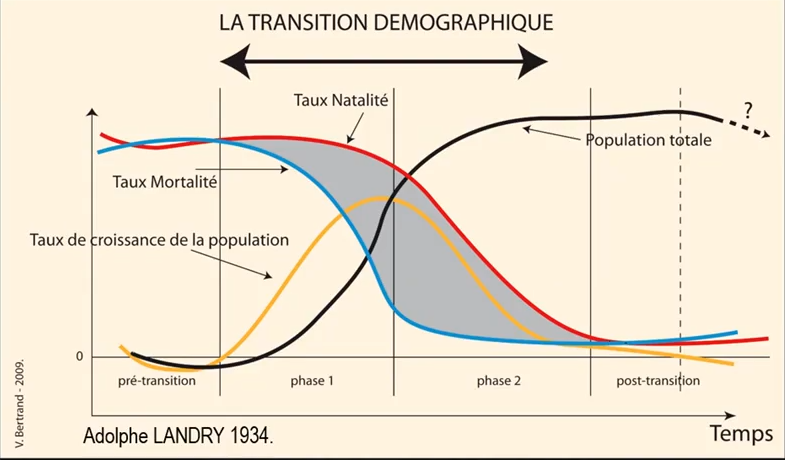

# Objectif TEPOS

## Qu'est ce qu'un géographe ?

- analyse territoriale : on voit les forces et les faiblesse d'un territoire et on imagine un projet idéal pour le territoire 
- préservation des espaces naturels et patrimoniaux 
- aménagement du territoire 
- développement des territoires

## Les bases du nouveau SGA

Depuis 20 ans, on vit une époque de transformation qui touche tous les domaines de la société. Le TEPOS touchent à pleins de domaines. Nous allons nous concentrer sur le domaine de l'énergie.

Un TEPOS est un est un territoire à énergie positive : territoire qui produit plus d'énergie qu'il n'en consomme mais qu'il ne repose que sur ses ressources naturelles renouvelables. Environnementalement c'est possible, technologiquement possible. Cependant l'appareil actuel de distribution de toutes les biens et services de nos besoins ne sont pas organiser pour ça. C'est donc une question d'organisation des territoires.

Les territoires ruraux ont une grande facilités à se transformer en énergie positive. En ville, la chose est tout autre. Il faut que le territoire soit exportateur pour alimenter les villes. Il faut un échange entre les villes et les campagnes.

Le concept de TEPOS est né dans les années 80 aux USA. C'est un ingénieur en énergie Amory Lovis, en créant un article sur  l'énergie et la transition énergétique. Sa secrétaire se trouve est inscrit Négawatt au lieu de Mégawatt. L'ingénieur va se rendre compte que la solution pour la transition énergétique repose dans l'efficacité, la sobriété. Si on veut avoir un système basé sur les energies renouvelables, il faut arrêter de gaspiller. Pour cela il faut arrêter le système, d4eXtraction, production, stockage, transport, distribution de l'énergie. 

Si on veut avoir unn système basé sur les énergies renouvelables, il faut arrêter de gaspiller. Cependant, il faut au moins 30 ans pour le faire. Cela est possible. 

- sobriété : ne consommer que ce qu'on a besoin
- efficacité : stratégies d'urbanisme et d'aménagement
- renouvelable 

**Un TEPOS est un territoire qui satisfait à l'ensemble de ses besoins en énergies en s'appuyant sur ses seules ressources renouvelable. L'échelle du territoire est essentiel.**

L'idée du TEPOS est de passer d'un monde en 100% énergie renouvelable.

## Elements de contexte

Beaucoup d'enjeux au niveau économique, de l'emploi et des finances. Si on transforme les bâtiments efficaces et sobres. On peut créer 1.7 millions d'emplois et leur donner un emploi durant 30 ans. Rénovez tous les logements, les commerces, les bureaux, il y a un outils extraordinaire pour relancer l'économie.

Jusqu'en 2004, le France exporte plus qu'elle n'en importe. L'élément qui est intéressant hors énergie, elle a été positive jusqu'en 2010. L'énergie est le poste le plus important dans notre déficit. Cela donne une idée du poids de notre facture énergétique. On importe 50 milliards par an d'énergie fossile en France.  

## I) Un constat inquiétant

- crise
- pénurie ponctuels
- pollutions
- inégalités
- tensions politiques
- idée de fin du monde

### A) Toujours plus

Nous sommes de plus nombreux, on veut tous être plus gourmand. Cette organisation à l'échelle planétaire donne de plus en plus d'injustice.

Nous avons plus de nourriture que nécessaire mais elle n'est pas partagée équitablement. 1/3 de notre production fini à la poubelle. On aurait de quoi nourriture 11 milliards d'habitants. Le progrès technique a permis la croissance démographique. La ressource en eau va être une problématique très forte. On risque de se retrouver avec des territoires très inégalitaires. (fonte des glaces très rapides, augmentation de cyclones, de tempêtes). 

La vallée du Rhône permet d'alimenter l'agriculture, hors celle ci provient, la font des glaces tous les ans ainsi que de la pluie. Ce qui pose un gros problème. Ainsi que pour l'échange des commerces, le refroidissement des centrales nucléaires ainsi que pour l'eau potable. On risque d'avoir des problèmes dès les années 30.

La première cause de la baisse de mortalité en Europe est l'amélioration de la ration alimentaire : révolution agricole. Ensuite, grâce à la révolution sanitaire. Le taux de natalité met du temps à baisser lié aux cultures, tradition, mentalité. Le pays qui a fait sa transition le plus tôt et le plus l'lentement est la France. Celui qui a été le plus rapide c'est le Japon, il l'a effectué en 25 ans. Tous les pays ne sont pas engagé de la même façon dans la transition. La phase 1 (baisse de mortalité) concerne les pays qui n'ont pas encore atteint leur maximum de croissance. En Europe ont est en phase 2, les pays ont une démographique qui augmente mais on déjà atteint le pic de croissance. 

Le maximum du taux de croissance qu'one st connu est dans les années soixante. Le moment où on a atteint le rythme de croissance mondial le plus élevé. **La population cessera de croître lorsque tous ses habitants auront atteint un stade de développement économique suffisant.**

Si on veut généraliser le modèle actuel que les américains utilisent, il nous faudrait 3 planètes. Les facteurs sont :

- niveau de carbonation 
- niveau de vie
- croissance de la population

conséquence de la décentralisation lié à la mondialisation : population diminue. 2 000 milliardaires en 2019 dû la concentration financière des industries. On a une hausse du niveau de vie mais les inégalités sont plus grandes.

Nous avons une désertification rurale et un étalement urbain.

## B) Tous drogués

On utilisent de l'énergie fossile tous les jours. Sans énergie et sans argent, on ne fait rien.

La richesse est l'énergie. La richesse d'un territoire est l'ensemble des biens et services disponibles pour la satisfaction des besoins de la population de ce territoire.

Qui génère la richesse :

- la planète
- l'homme

Comment accroître la quantité de richesse globale disponible ?

En allant voir ailleurs :

1. conquête de nouveaux territoires
2. découvertes de nouvelles ressources 
3. créations de nouveaux biens et services 

En modifiant nos façons de faire :

4. augmentation de la capacité de travail de l'Homme
5. augmentation de la productivité humaine

Tous cela grâce : 

- nouvelles techniques d'assolement
- par la sélection
- par l'emploi de pesticides et insecticides
- maîtrise de l'eau
- l'emploi d'engrais naturels ou chimiques

### 200 esclaves chacun

Si on passe notre vie à pédaler, on ne peut pas alimenter le frigo. Aujourd'hui dans le monde chaque individu consomme 200 esclaves énergétiques. On consomme une énergie de plus en plus et elle est de plus en plus concentrée. La puissance est en kW, la production est en W/h. Dans un litre d'essence, on a 23 tonnes de biomasse pour avoir au final 9KW. On consomme de plus e plus, les pays occidentaux on atteint un palier, voir commence à décliner. La Chine augmenta la capacité. On a actuellement décentralisé et délocaliser donc on ne peut pas dire qu'on est passé à la transition énergétique. 1Kg de tomates sous serre chauffée correspond à 1 litre de pétrole pour l'alimenter en engrais et chauffer la serre. Le coût d'un baril de pétrole est fonction de la zone où ce dernier à été exploité.

### Les signaux passent au rouge

Le rayonnement solaire passe à travers l'atmosphère claire. Une partie du rayonnement solaire est réfléchie par l'atmosphère et la surface de la Terre. L'énergie solaire est absorbée par la surface de la Terre et la réchauffe. Elle est ensuite convertie en chaleur renvoyant l'émission d'un rayonnent IR vers l'atmosphère. Une partie du rayonnement infrarouge est absorbée et ré émise par les molécules de gaz à effet de serre. a conséquence directe est la réchauffement de la surface de la Terre et de la troposphère. Une partie du rayonnement solaire passe à travers l'atmosphère et se perd dans l'espace.

## II) Comment faire un TEPOS

### 8000 fois nos besoins

Un territoire a énergie positive, le Soleil nous offre 8000 fois ce que l'on consomme sur Terre. Il permet de se rendre compte de la quantité d'énergie renouvelable. L'important, c'est la capter, la stocket et d'éviter de la gaspiller (NégaWatt). Grosse contrainte :  intermittente, variable dans le temps d'une saison à l'autre et elle est dispersée.

Depuis la logique du renouvelable on a différents types :

- éoliennes offshores : espace naturel, loin de la berge et le vent est plus fréquent 
- hydrolienne marine, utilise la houle : on peut l'installer sur tous les littoraux et l'énergie et toujours présente
- géothermie profonde : utilise une ressource naturelle en profondeur
- central photovoltaïque
- biomasse : culture d'algue

On capte au maximum l'énergie que la nature nous fournit. Dans l'habitat, il faut un bioclimatique pour avoir le soleil passif. Il va se chauffer lui même. La casquette est calculé en fonction de l'altitude et de la saison. Comme ça pas de surchauffe en été. Lorsque l'on fait une opération d'un bâtiment, on pense à l'orientation.

### Le photovoltaïque

- 0,5MW/ha (au sol)
- 0,1kWc/m²

Le recyclage n'est pas encore généralisé. Il y a su silicium, phosphore, bore, arsenic, antimoine. La pente en Lorraine doit être de 30° pour l'optimum. C'est rentable sur le long terme.

Agromine : Chercher des gisements à faible concentration. On a des pistes de recherches Econick.

### Éolien

Hydrolienne : pas en pointe en France mais potentiel intéressant (2 GW en France). On résonne mixte renouvelable : complémentarité

### Fracturation du sous-sol

La température à 5 000 m de profondeur est constante à 250°C, y envoyer l'eau et la repomper. La dilatation se fait sur plusieurs kilomètres, donc il faut trouver un bon alliage. On peut les récupérer dans des sous-sols sédimentaires. Aujourd'hui l'installation permet d'avoir une suffisance pour une ville de 20 000 habitants en Alsace.

### Biocarburants

Cultivé du colza pour le transformer en bioéthanol. On a un pourcentage 10% de bioéthanol dans notre essence pour voiture. Ce bioéthanol va consommer de la terre agricole et avec des engrais chimique, bilan carbone plutôt négatif.

### Pétrole via les algues

Pour nourrir les algues, l'entreprise récupérer le CO2 d'une cimenterie et nourrissait les algues avec l'intégralité. Le rendement est 100 fois supérieur à celui du colza par unité de surface. Les algues ne sont pas en compétition avec notre nourriture. 

### Pile à combustible

L'idée est de stocker des bonbonnes d'hydrogènes. L'hydrogène est explosif. Le risque 0 n'est pas encore atteint. Comment on fait pour alimenter els bonbonnes en hydrogène. Une fois que l'on a consommé de l'hydrogène, on rejette de l'eau. La pollution peut être en amont. Si on utilise de l'hydrogène avec du méthane, il ya un risque où on émettra du CO2. Cela n'a de sens que si on utilise un outils propre pour transformer du gaz ou de l'eau en hydrogène.

### Biomasse

En Autriche, une ville développe une usine qui récupère les résidus de bois pour les br^ler et produire du gaz, de la chaleur et de l'électricité. Elle a rendement efficace car toute l'énergie émise sera récupérer soit sous trois formes qui vont permettre d'alimenter les bâtiments ou les véhicules qui peuvent fonctionner au gaz.

### Toilèttes seches

composte, engrais avec les urines. Économiser une dépense énergétique.

### Métanisation

fermentation qui va créer du gaz et va donner du méthane.

### Troisième révolution industrielle

Nous nous dirigeons vers un 3e age. Celui de l'information partagée d'une révolution scientifique et technique et d'une énergie décentralisée
Fin durable du plein emploi middle class fragilisé, nouveau contrat social, la nécessaire empathie. Un revenu minimum garanti pour tous.
La troisième révolution industrielle Jeremy Rifkin

### De l'âge du carbone à l'âge du solaire 

Le 100% renouvelable est inévitable. Quand est ce qu'on décide d'y aller. Le but de demain ça d'avoir le mix 100% renouvelable. 

### La ferme du bec Hellouin

1000 arbres avec 500 variété=té, 8 personnes à temps plein sur 20 ha?
Pas de pétrole, pas d'engrais chimique, pas de pesticide

Agriculture conventionnelle : 1 calorie alimentaire produite pour 10 calories fossiles consommées. Un écosystème optimisé, compris, réfléchi. Un laboratoire suivi par l'INRA.

### Ville en transition

Avec la fin du pétrole, la théorie de la rente de Ricardo irait au rebu. Devient ITD intégration territoire développement.

