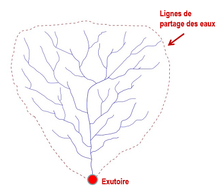
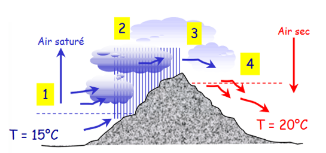
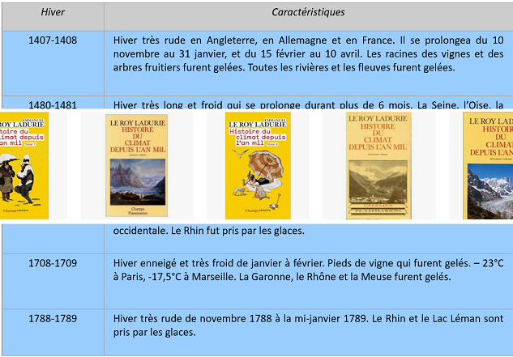
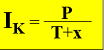
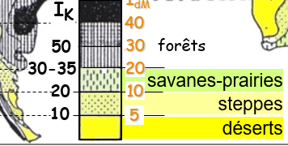

# Le climat

## Introduction

On va s'intéressé au cycle de l'eau à l'échelle d'un bassin versant, qu'est ce qu'il se passe suite un événement pluvieux. La pluie tombe, une partie va s'évaporé, une partie va s'écouler et une partie va s'infiltrer. Les nappes et les écoulements vont se retrouver dans une rivière. 

Le bassin versant est défini comme **la surface drainée par le cours et ses affluents en amont de l'exutoire**. Tout écoulement prenant naissance à l'interieur de cette surface doit donc traverser l'**exutoire** pour poursuivre son trajet en aval. La ligne en pointillé, signifie la **ligne de partage des eaux**.

Les exutoires ont les choisis en fonction de notre étude. On peu le prendre à n'importe quel point du bassin. Elle est utilisé en France pour la gestion des eaux. La gestion de l'au s'appuie sur les limites des bassins versants. La gestion de l'eau s'organise par grands bassins hydrographiques : le territoire des six agences de l'eau crées par la loi de 1964 résulte d'un découpage naturel suivant la ligne de partage des eaux.

Tout aménagement sur un cours d'eau doit être raisonné. Ce découpage est repris aussi à l'échelle de l'Europe. Les **districts hydrographiques**. Le Meuse se jette du Nord.On est dans un territoire où l'agence de l'eau ne peut pas prendre des mesures sans coopération avec les pays voisins.

Nous allons comprendre d'où vient le débit. On va l'observer en suivant les écoulements de la rivière, au niveau des stations hydrométriques. Ces données de débit sont disponibles en ligne. L'**hydrogramme** est un graphique qui représente l'évolution du débit en fonction du temps. Comprendre pourquoi l'hydrogramme a cette forme. Si le débit augmente, le niveau de la rivière augmente, dû à la pluie. Pour un bassin versant, on pourrait avoir une réponse différente pour un même épisode pluvieux. Des cours d'eau peuvent répondre tout de suite. La pente est un facteur important. Plus la pente sera forte, plus le débit sera fort. En Hydrologie on essaye de choisir des petits bassins versants testent qui sera homogène. Un bassin versant forestier n'aura pas le même hydrogramme qu'un bassin versant urbanisé. Une grande partie de l'eau va s'infiltrer en forêt contrairement à l'urbanisation. Cela dépend aussi de la géologie du sol.

Le climat va nous expliquer l'origine d'écoulement des rivières. Quand on regarde les pluies, il n'y a pas de saisonnalité. Les précipitations sont réparties tout au long de l'année. On comprend que ce n'est pas uniquement les pluies. On observer une augmentation de la température est donc plus d'évapotranspiration.

## I) Les régimes climatiques 

Le climat, pour satisfaire les sociétés, devrait suivre une courbe idéale. Les excès climatiques qui se produisent de temps à autre sont souvent mal acceptés. Dégâts lié aux tempêtes, étiage du Rhin pendant les sécheresses récurrentes. Le climat a parfois des extrêmes. Le climat fluctuent au cours du temps en fonction des facteurs **astronomiques, atmosphériques et topographiques**.

### La météorologie

La météorologie procède à l’observation et à l’étude des états de l’atmosphère. Elle est fondée essentiellement sur les lois de la mécanique des fluides et de la thermodynamique. Elle a pour **objectif principal la prévision du temps**. 

### La climatologie

La climatologie est une science de l’atmosphère qui a pour objectif la description synthétique, le classement et l’explication de la répartition des différents types de climats présents sur la terre. Il s’agit d’une **science rétrospective fondée sur de longues séries d’observations antérieures**. Il peut donner le type de climat dans une région, une ville. Le climat est un ensemble fluctuant des conditions atmosphériques caractérisé par les états et les évolutions du temps au cours d’une période suffisamment longue dans un domaine spatial déterminé.

**La climatologie et la météorologie n'ont pas les mêmes objectifs**.

On a trois zones climatiques : 

- zone froide : toutes les températures mensuelles sont inférieurs à 10°C. Pas d'arbres dans cette zone.
- zone chaude : toutes les températures mensuelles sont supérieur à 18°C
-  zone tempérée : entre les deux

### Les échelles spatiales

L'échele mondial est très large **macroclimat**. Si on passe à l'échelle de la France **mésoclimat**. Le détaille sera plus grand. Nous sommes dans un climat semi-océanique dégradé. Le climat local s'appelle le **topoclimat**.

Le **microclimat** est l'échelle d'ue maison, d'une terre agricole.

### Les échelles temporelles

On a eu une altérnance entre les périodes froides, glaciaires et les périodes chaudes, interglaciaires. On est sur des cycles de 100 000 ans.La période très récente est un réchauffement dont le facteur est anthropique.

Le réchauffement actuel est assez rapide est accéléré.

### Les paramètres d'identification d'un climat

Deux paramètres généraux : température et précipitations 

Température : phénomène continu, il y a en tout le temps. On mesure quotidiennement est la moyenne des températures journalières.

Précipitation : phénomènes discontinues. Jour par jour, mois par mois et par années. On va faire un **cumul**. Pas de sens de faire la moyenne. 1 mm d'eau sur 1m² correspond à 1 litre.

Pour les paramètres climatiques (P & T), on se réfère à une **normale** qui est la **moyenne d’une série de 30 ans** (actuellement et jusque fin 2020 : 1981-2010).

### La variabilité saisonnière

Les  variations saisonnières moyennes constituent le **régime climatique**. Il synthétise l’organisation et l’enchainment des saisons. On peut considérer ainsi le **régime des températures et le régime pluviométrique**. 

Les saisons peuvent être :

- **thermiques** : les températures varient et les pluies sont constantes
- **thermiques et pluviométriques** : pluviométrie et thermiques varient ensemble
- **pluviométriques** : dans la zone chaude, les températures sont constantes, la distinction saisonnière est due à la pluie.

On ne retrouve que les 4 saisons en climat tempérés.

### L'amplitude thermique moyenne annuelle

Amplitude thermique moyenne annuelle : Différence entre les températures (en moyenne) du mois le plus chaud et du mois le plus froid.

Elle va nous permettre de nous situé. Les régions de la zone chaude ont une très faible amplitude. Quand on se situe à proximité des océans, on a aussi une amplitude thermique. L'océan possède une grande invertie, il va mettre du temps à se réchauffer et à se refroidir. Les vents viennent d'ouest en est. Plus on avance au coeur du continent, plus l'amplitude va augmenter. Plus on se décale, plus l'amplitude augmente.

### Notion d'aridité

L’**aridité** est le caractère sec habituel d’un climat. Elle se distingue de la sécheresse qui est un évènement. Il existe plusieurs indices qui permettent d’évaluer l’aridité d’un climat.

On va utiliser trois indicateurs :

- **indice de Gaussen** : les pluies sont inférieurs à deux fois la température, c'est un mois sec. Sauf pour les mois froids inférieurs à 5°C, les précipitations doivent être inférieurs à 10 mm.
- **indice de Martonne** :     

Avec :   
P les précipitations moyennes annuelles (en mm)   
T les températures moyennes annuelles (en °C)    
p les précipitations moyennes (en mm) pour le mois le plus sec (où p/(t+10) est mini)    
t les températures moyennes (en °C) pour le mois le plus sec (où p/(t+10) est mini)    

- **indice de Köppen** : 

Avec :   
P les précipitations moyennes annuelles (en mm)    
T les températures moyennes annuelles (en °C)     
x = 0 ou 7 ou 14 selon la saison sèche (au moins 2 mois secs selon Gaussen) :    
	0 : saison sèche d’été    
	7 : pas de mois secs      
	14 : mois secs d’hiver     

## II) Analyse du climat

### Diagramme ombro-thermique

On va sur un des deux axes, les témparatures et les précipitations, en mettant les précipitation deux fois plus espacés que les températures (pour 10 mm, on met 5°C). En fonction des mois.

### Les domaines climatiques

### La zone chaude 

Le climat tropical : 
- une saison sèche de plusieurs mois ;
- une saison des pluies correspondant à l’été de l’hémisphère ;
- amplitude thermique moyenne annuelle < 10°C.

Les nuances du climat tropical :

1. Nuance tropicale sèche  Aw /BSw
- courte saison des pluies : P < 600 mm
2. Nuance  tropicale humide
- une courte saison sèche : P > 1000 mm
3. Nuance  moussons Aw(m) (Asie)
- une saison des pluies violente. Mousson d’été ou/et d’automne
- Saïgon : les 2 

Le climat équatorial :

- très faible amplitude thermique moyenne annuelle (< 5°) ;
- pluies tout le temps ;
- maximum de précipitations aux alentours du passage du soleil au zénith (équinoxes) ; 
- 2 saisons des pluies parfois bien marquées.

### La zoné tempérée

Le climat méditerranéen :
- en façades occidentales de continents, sous le climat océanique en latitude ;
- été sec et chaud ;
- précipitations de saison froide ;
- amplitude thermique moyenne annuelle entre 15 et 20°C.

Nuances du climat méditerranéen : 

Nuance humide, Méditerranée occidentale :
- courte saison sèche 2 à 5 mois ;
- Indice de Köppen > 20 ;
- précipitations > 600mm avec un maximum d’automne et un maximum secondaire de printemps.

Nuance sèche , Méditerranée orientale, transition  vers les déserts : Cas et BSs
- longue saison sèche, 5 mois et > ;
- Indice de Köppen < 20 ;
- précipitations < 500 mm avec un maximum de printemps.

Le climat océanique :

- précipitations en toutes saisons ;
- été doux et humide ;
- hiver frais et humide ;
- amplitude thermique moyenne annuelle entre 10 et 20°C
- précipitations accrues  sur les reliefs exposés aux vents d’ouest (Bergen, les Vosges Lorraines…)

Le climat continental :

- maximum de précipitations en été ;
- Été plus ou moins chaud et humide ;
- hiver froid et sec ;
- précipitations diminuant avec l’éloignement des océans ;
- amplitude thermique moyenne annuelle supérieure à 20°C ;
- peut -être très sec : Dw/BSw voire Dw/BWw
  
Le climat  humide des façades orientales de continent  (subtropical humide , surtout en Asie ) Caf-w  Daw-f

Comme le climat continental :

- maximum de précipitations en été ;
- hiver froid et sec ;
- amplitude thermique moyenne annuelle supérieure à 20°C ;
- précipitations diminuant avec l’éloignement des océans.

Mais avec un été tropical : 

- été très chaud (plusieurs mois chauds > 22°C)
- été très humide (précipitations de type mousson en Asie)

Les nuances du climat humide des façades orientales de continent (subtropical humide , surtout en Asie )

La nuance chinoise : 

- saison humide d’été vraiment tropicale, plus courte avec la latitude et l’éloignement de la mer ;
- peut-être très sèche :  Dw / BSw  voire Dw / BWw

La nuance américaine : 

- hiver plus neigeux, moins protégé des influences maritimes, moins constant ;
- été moins chaud

Le climat de toundra : 

- connaît un dégel durant quelques mois ;
	
Il peut être de type océanique comme Isfjord Radio  ETf 

- précipitations toute l’année, faibles ;
- amplitude thermique moyenne annuelle de l’ordre de 20°C

Le climat d'inlandisis EF

- connaît le gel permanent

