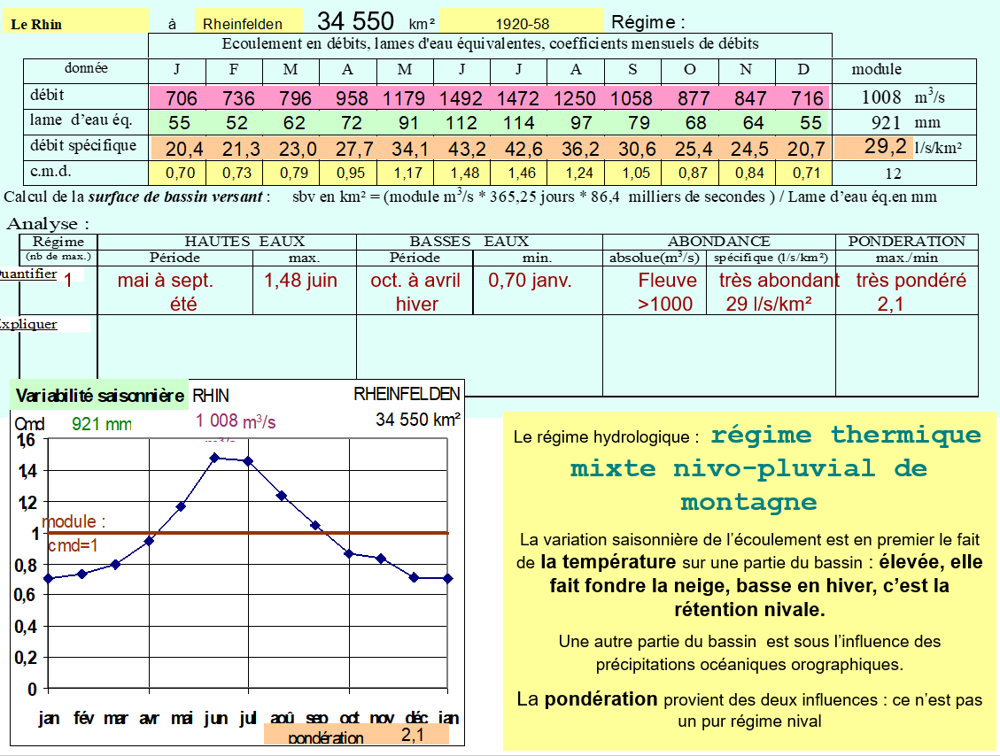

# Les régimes hydrologiques

## I) Bassin versant et réseau hydrographique

Espace drainé par un cours d’eau et ses affluents. Espace topographique, délimité par des lignes de crêtes, que drainent un cours d’eau principal et ses affluents vers un point  de sortie unique, appelé l’exutoire. Lieu par où s’écoulent toutes les eaux courantes d’un bassin versant

## II) La donnée hydrologique

- Le débit m3/s … mal connu : pas d'outils pour le mesurer directement 
- Le débit spécifique l/s/km²
- La lame d’eau équivalente mm

La hauteur d’eau, lue à l’échelle limnimétrique, est la seule donnée hydrométrique observable et enregistrable. Le  débit peut être mesuré ponctuellement : il est connu seulement lors de la mesure, et encore, avec une précision de l’ordre de  ± 10% dans le cas de bonnes conditions de mesure.

On établi ensuite une relation entre la hauteur d'eau et le débit.

### Lame d'eau

### Le débit

L'équation du débit **Q = P - E (∆réserves)**

Avec l'expression en lames d'eau (mm) l'écoulement peut - être comparé à la pluie et à l'évapotranspiration et permettre à la pluie et à l'évaporation et permettre d'établir un bilan de l'eau.

Le débit spécifique est simplement le débit divisé par la surface de bassin versant. Comme la lame d’eau, il représente le rendement moyen d’une unité de surface du BV et permet ainsi de comparer tous les cours d’eau entre eux. On l’exprime en litres et non en m3 par commodité. À la différence des lames d’eau, qu’on somme, le débit spécifique moyen annuel (ou module spécifique) est bien une moyenne.  

**Qspé = Q (m3/s) / SBV (km²)  x 1000 (litres/m3)**

Période de hautes eaux lorsque le débit fort durant les périodes hivernales  et les périodes de basses eaux, l'été quand le débit est plus faible.

### Les régimes

- Régime pluvial : pluie
- Régime thermique : température chaude qui font fondre la neige

#### Pluvial océanique

Haute eaux en Hiver lié aux pluies. Les basses eaux correspondent à l'augmentation des températures qui évaporent plus.

La différence d'écoulement entre les mois est le fait de l'**evaporation** : forte en été et quasi-nulle en Hiver, non des précipitations, relativement constantes en moyenne. La **pondération** dépend de la présence de nappes souterraines dans le bassin.

#### Pluvial méditerranéen

L'écoulement est lié à la **saison des pluies** ( de l'automne au printemps); léger creux au coeur de l'Hiver. La **pondération** : régime très excessif, en raison d'une saison quasi sans écoulement et des impacts cumulés de la pluie et de la température.

#### Pluvial équatorial

L’**écoulement est lié à la saison quasi-continue des pluies**. 
La **pondération** est bonne : régime moyennement pondéré  par l’existence de deux maximums pluviométriques (en général dissymétriques).

#### Pluvial tropical 

Une saison sèche et une très forte saison des pluies de juillet à octobre.

### Le régime thermique

#### Le régime glaciaire

Le régime hydrologique :  régime thermique glaciaire de montagne

L’écoulement est complètement lié à la température parce que les glaciers et neiges éternelles occupent plus de 10%  du bassin 
à la fin de l’été, le stock neige-glace n’est pas fondu (septembre en hautes eaux) mais les températures baissent, le gel revient. La pondération est mauvaise : régime excessif

#### Le régime thermique nival 

L’écoulement est lié à la température mais il n’y a pas de neiges éternelles (ou moins de 2%  du bassin) : c’est la fonte de printemps. En été, le stock de neige est fondu ; avant la reprise du gel en automne, les écoulements viennent des pluies.  La pondération est mauvaise  dans les petits bassins versants : régime excessif. Au mois de mai, on est déjà au période de haute eaux. Le stock de neige fond rapidement.

#### Le régime thermique nival de plaine

L’écoulement est lié à la température mais la fonte de printemps intervient en masse : c’est la raspoutitza
En été, les précipitations modestes du climat continental ne compensent pas l’évaporation : avant la reprise du gel en automne, les écoulements restent faibles. 
La pondération est mauvaise : régime  excessif.

Le régime d’un cours d’eau des hautes latitudes (limite zone froide) prend les caractéristiques du régime glaciaire de montagne mais le BV est immense et l’abondance spécifique faible (pas de confusion possible) :  l’été est court.

#### Le régime nivo - pluvial océanique

L'influence des températures domine dans le régime avec la fonte de printemps et la rétention nival d'hiver (cmd<1). Mais les caractères du régime pluvial océanique sont sensible : baisse appuyée des écoulements en été du fait de l'évaporation et remontée en automne. La pondération est produite par les deux influences.

#### Régime complexe

Le rhône connaît plusieurs régimes. En amont il est en régime thermique en montagne. Puis il a un régime méditerranéen du fait de différentes rivières de ce régime qui influe sur son régime.

